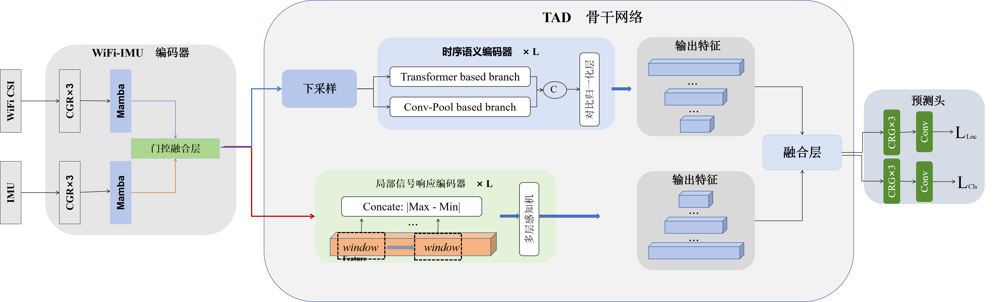
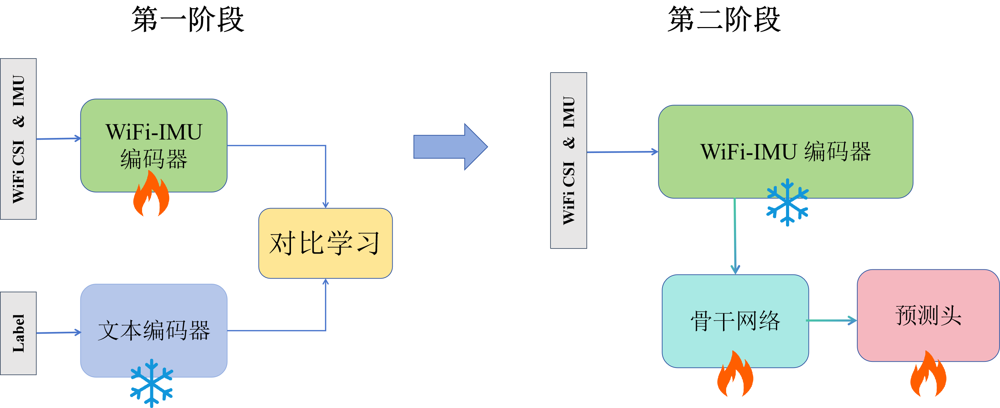

# CLIPTAD

## 概述

随着物联网技术的快速发展，使用物联网设备检测人类日常活动在许多场景中得到了应用。长期活动检测能够提供更全面的个体行为模式，为此研究者更加关注长期活动检测领域，尤其是时序活动检测任务（Temporal Activity Detection,TAD）。当前主流的时序活动检测方法是基于视觉模态。然而，基于视觉模态的方法在光线暗的环境中性能不佳，且直接收集视觉信息可能会造成隐私泄露的问题。为此，研究者开始探索基于 WiFi 信道状态信息（Channel State Information, CSI），惯性测量单元（Inertial Measurement Unit, IMU），雷达等非视觉模态的替代方案。对比视觉模态，非视觉模态数据缺乏直观的空间信息且更易受到噪声干扰，因此传统的视觉模态方法难以直接迁移应用。针对不同的非视觉模态数据的特性，需要设计定制化的检测方法。本文提出了一种基于 WiFi CSI 与 IMU 多模态数据的框架 CLIPTAD（Contrastive Language-Sig-PreTraining for Temporal Activity Detection）。在 CLIPTAD 模型中，本文通过将 WiFi-IMU 信号嵌入与文本嵌入映射到统一的嵌入空间，使信号嵌入具备更丰富的语义表征能力，从而提升模型的性能。实验结果表明，CLIPTAD 在具有更低的计算复杂度的同时依然能够保持优异的识别性能。CLIPTAD 的GFLOPs 仅有 11.93，是基线模型的 1 4，同时平均识别准确率为 75.30%，对比基线模型准确率提升约 3%。此外，为了直观展示工作成果，本文还设计并实现了一个基于 Flask 框架和HTML 的交互式可视化系统。该系统可直观呈现：（1）CLIPTAD 处理的多模态数

据类型；（2）时序活动检测任务的完整处理流程；（3）模型预测结果的可视化分析。

## 任务演示

https://github.com/user-attachments/assets/d246f22c-accb-4096-8ccc-afb178d373a4

## 算法架构

